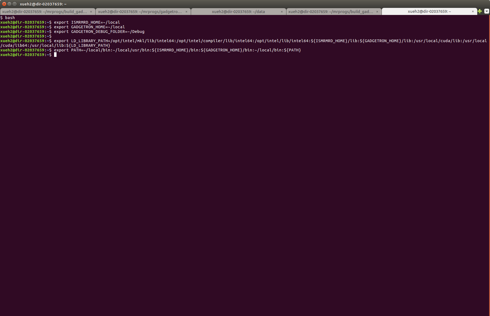
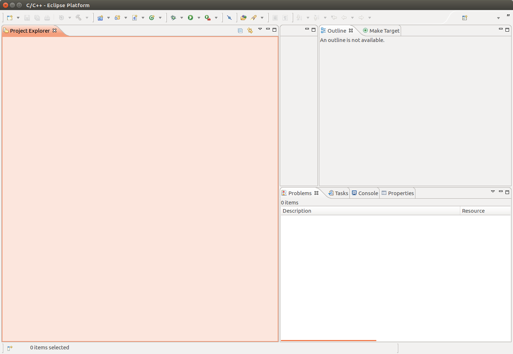
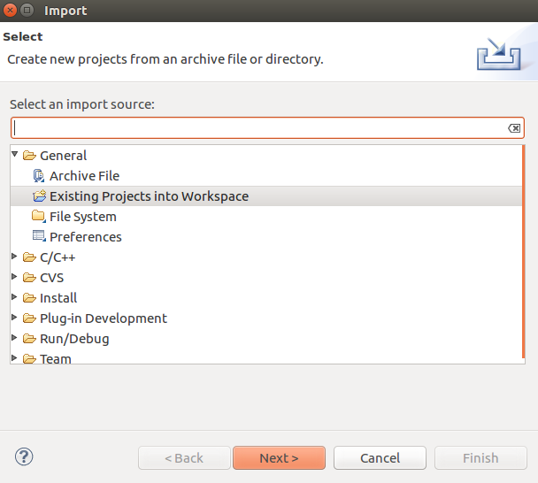
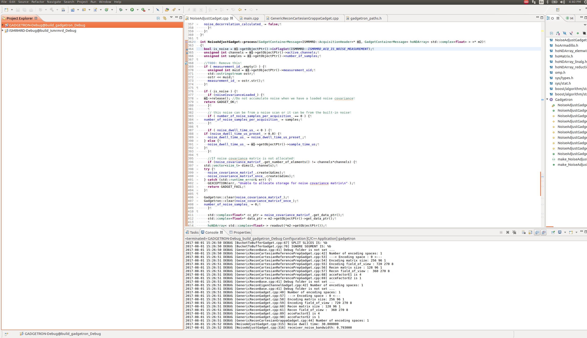
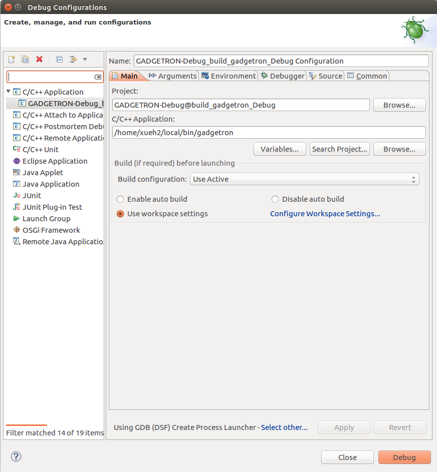
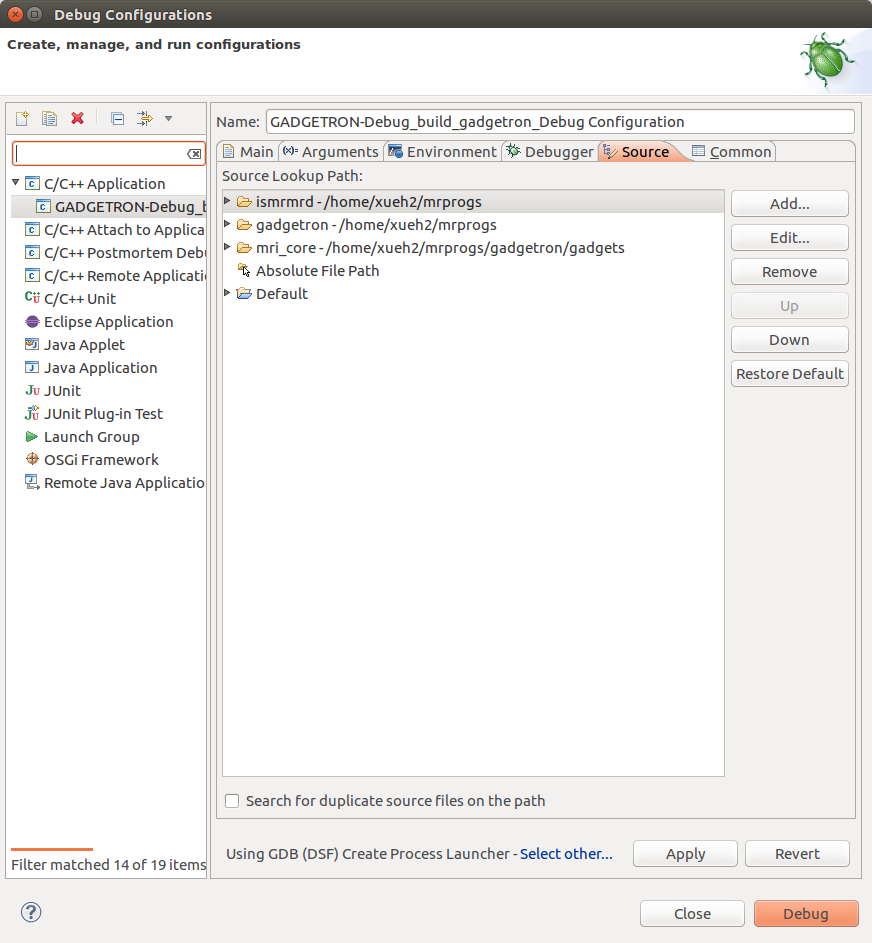
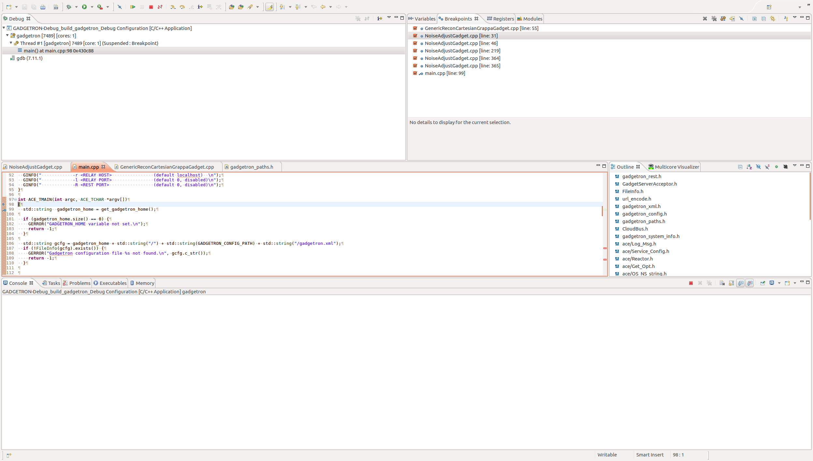
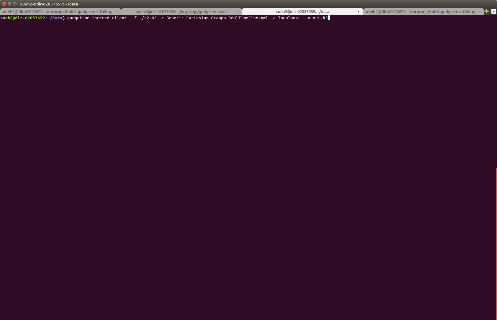
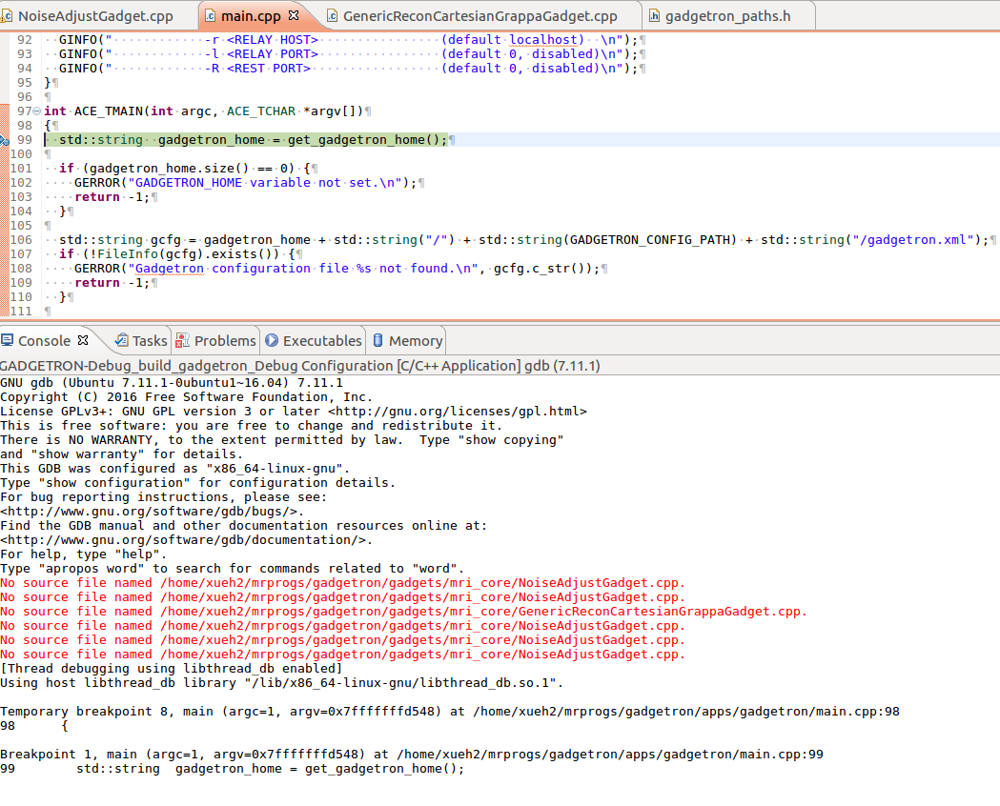
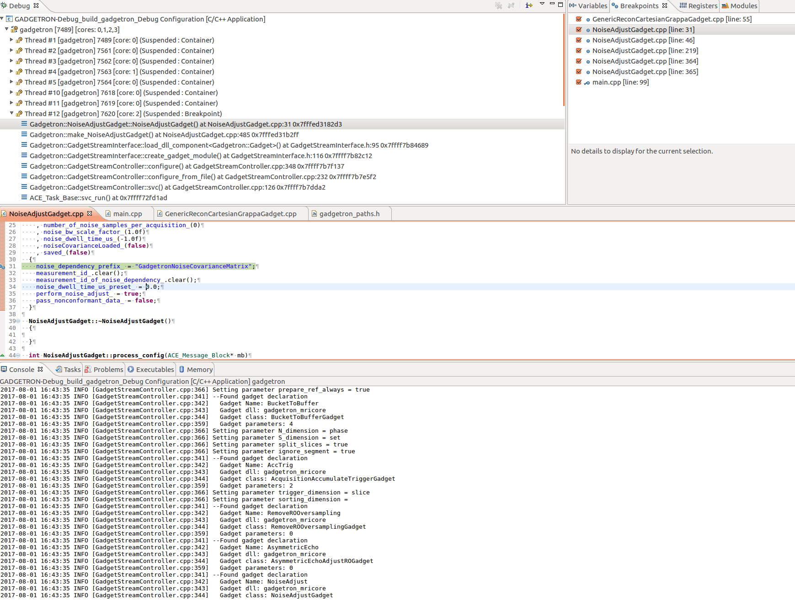

Gadgetron components are often developed in linux environment. This wiki page describes a set up to allow visual debug gadgetron process/gadgets/toolboxes in linux usingthe Eclipse (<http://www.eclipse.org/downloads/download.php?file=/technology/epp/downloads/release/oxygen/R/eclipse-cpp-oxygen-R-linux-gtk-x86_64.tar.gz>).

### Install Eclipse
```
sudo apt-get install eclipse eclipse-cdt
```
alternatively, it is convenient to download the latest eclipse and install it from:

```
https://www.eclipse.org/downloads/
```

### Compile Gadgetron and related packages
This section will describe how to set up gadgetron on your local folder(~). Instead of installing Gadgetron to system folder (`/usr/local`), the Gadgetron and related packages will be installed to `~/local`.

#### Install Gadgetron dependencies
If the dependencies of Gadgetron has not been installed, system admin should conduct the installation:
```
sudo apt update
sudo apt install --no-install-recommends --no-install-suggests --yes apt-utils software-properties-common wget build-essential cython3 libcrypto++-dev  python3-dev python3-pip libhdf5-serial-dev cmake git-core libboost-all-dev libfftw3-dev h5utils jq hdf5-tools liblapack-dev libatlas-base-dev libxml2-dev libfreetype6-dev pkg-config libxslt-dev libarmadillo-dev libace-dev libgtest-dev liblapacke-dev libplplot-dev gcc-multilib supervisor net-tools cpio libpugixml-dev jove libopenblas-base libopenblas-dev

sudo pip3 install -U pip setuptools testresources
sudo DEBIAN_FRONTEND=noninteractive apt install --no-install-recommends --no-install-suggests --yes python3-tk
sudo pip3 install numpy scipy pandas Cython tk-tools matplotlib seaborn scikit-image opencv_python pydicom scikit-learn sympy Pillow==7.1.2 h5py pyxb
sudo pip3 install torch torchvision
sudo pip3 install onnx onnxruntime
sudo pip3 install --upgrade tensorflow

```
For some libraries, my experiences are to download and compile them:
```
mkdir ~/code && \
cd ~/code && \
wget https://dicom.offis.de/download/dcmtk/dcmtk365/dcmtk-3.6.5.tar.gz && \
tar xvf ~/code/dcmtk-3.6.5.tar.gz && \
mkdir ~/code/dcmtk-3.6.5/build && \
cd ~/code/dcmtk-3.6.5/build && \
cmake -DBUILD_SHARED_LIBS=ON ../ && make -j16 && sudo make install
```
and
```
cd ~/code && \
git clone https://github.com/google/googletest.git && \
cd googletest && \
mkdir build && \
cd build && \
cmake -DBUILD_SHARED_LIBS=ON -DCMAKE_BUILD_TYPE=Release ../ && \
make -j $(nproc) && sudo make install
```
Also, please consider to use the Intel MKL as the main math libraries. Intel MKL can be freely downloaded now from:
```
https://software.intel.com/en-us/mkl/choose-download
```
#### Compile ISMRMRD (<https://github.com/ismrmrd/ismrmrd>) and Gadgetron (<https://github.com/gadgetron/gadgetron>)
```
echo "This script will set up Gadgetron and related libraries in the home folder ~/local. The old installed gadgetron will be deleted!!!"

# set up the working directory to be the home folder
GT_WORKING_DIR=~
GT_INSTALL_DIR=${GT_WORKING_DIR}/local

# the branch to pull, can be changed
BRANCHNAME=master

# Build type
BUILD_TYPE=Release
# for debug, BUILD_TYPE=Debug

# Generator
GENERATOR="Eclipse CDT4 - Unix Makefiles"

# --------------------------------------------------------------------------------------------
# pull source from git hub

ISMRMRD_REPO=git@github.com:ismrmrd/ismrmrd.git
ISMRMRD_BRANCH=${BRANCHNAME}

GT_REPO=git@github.com:gadgetron/gadgetron.git
GT_BRANCH=${BRANCHNAME}

GT_CONVERTER_REPO=git@github.com:ismrmrd/siemens_to_ismrmrd.git
GT_CONVERTER_BRANCH=${BRANCHNAME}

ISMRMRD_PYTHON_API_REPO=git@github.com:ismrmrd/ismrmrd-python.git
ISMRMRD_PYTHON_API_BRANCH=${BRANCHNAME}

ISMRMRD_PYTHON_TOOLS_REPO=git@github.com:ismrmrd/ismrmrd-python-tools.git
ISMRMRD_PYTHON_TOOLS_BRANCH=${BRANCHNAME}

# ----------------------------------------------------------------------------------------------------------
# clean the old installation
# ----------------------------------------------------------------------------------------------------------
rm -R -f ${GT_WORKING_DIR}/local
mkdir -k ${GT_WORKING_DIR}/local
mkdir -k ${GT_WORKING_DIR}/mrprogs

GADGETRON_HOME=${GT_WORKING_DIR}/local
ISMRMRD_HOME=${GT_WORKING_DIR}/local
CMAKE_PREFIX_PATH=${GT_WORKING_DIR}/local/lib/cmake/ISMRMRD

# ----------------------------------------------------------------------------------------------------------
#ISMRMRD PYTHON API, require sudo to install
# ----------------------------------------------------------------------------------------------------------
cd ${GT_WORKING_DIR}/mrprogs
git clone ${ISMRMRD_PYTHON_API_REPO}
cd ismrmrd-python
sudo python3 setup.py install

# ----------------------------------------------------------------------------------------------------------
#ISMRMRD PYTHON TOOLS, require sudo to install
# ----------------------------------------------------------------------------------------------------------
cd ${GT_WORKING_DIR}/mrprogs
git clone ${ISMRMRD_PYTHON_TOOLS_REPO}
cd ismrmrd-python-tools
sudo python3 setup.py install

# ----------------------------------------------------------------------------------------------------------
# ismrmrd
# ----------------------------------------------------------------------------------------------------------

rm -R -f ${GT_WORKING_DIR}/mrprogs/ismrmrd
cd ${GT_WORKING_DIR}/mrprogs
git clone ${ISMRMRD_REPO} ${GT_WORKING_DIR}/mrprogs/ismrmrd
cd ${GT_WORKING_DIR}/mrprogs/ismrmrd
git checkout -b ${ISMRMRD_BRANCH} origin/${ISMRMRD_BRANCH}

rm -R -f ${GT_WORKING_DIR}/mrprogs/build_ismrmrd_${BUILD_TYPE}
cd ${GT_WORKING_DIR}/mrprogs
mkdir build_ismrmrd_${BUILD_TYPE}
cd ${GT_WORKING_DIR}/mrprogs/build_ismrmrd_${BUILD_TYPE}

cmake -G "${GENERATOR}" -DCMAKE_INSTALL_PREFIX=${GT_INSTALL_DIR} -DCMAKE_BUILD_TYPE=${BUILD_TYPE} -DJava_JAVAC_EXECUTABLE= -DJava_JAVA_EXECUTABLE= -DJAVA_INCLUDE_PATH=  ../ismrmrd

make -j $(nproc)
make install

# ----------------------------------------------------------------------------------------------------------
# gadgetron
# ----------------------------------------------------------------------------------------------------------

rm -R -f ${GT_WORKING_DIR}/mrprogs/gadgetron
cd ${GT_WORKING_DIR}/mrprogs
git clone  ${GT_REPO} ${GT_WORKING_DIR}/mrprogs/gadgetron
cd ${GT_WORKING_DIR}/mrprogs/gadgetron
git checkout -b ${GT_BRANCH} origin/${GT_BRANCH}

rm -R -f ${GT_WORKING_DIR}/mrprogs/build_gadgetron_${BUILD_TYPE}
cd ${GT_WORKING_DIR}/mrprogs
mkdir build_gadgetron_${BUILD_TYPE}
cd ${GT_WORKING_DIR}/mrprogs/build_gadgetron_${BUILD_TYPE}

cmake -G "${GENERATOR}" -DCMAKE_INSTALL_PREFIX=${GT_INSTALL_DIR} -DCMAKE_BUILD_TYPE=${BUILD_TYPE} -DCMAKE_PREFIX_PATH=${GT_WORKING_DIR}/local/lib/cmake/ISMRMRD ../gadgetron

make -j $(nproc)
make install
    
# ----------------------------------------------------------------------------------------------------------
# siemens_to_ismrmrd
# ----------------------------------------------------------------------------------------------------------

rm -R -f ${GT_WORKING_DIR}/mrprogs/siemens_to_ismrmrd
cd ${GT_WORKING_DIR}/mrprogs
git clone  ${GT_CONVERTER_REPO}  ${GT_WORKING_DIR}/mrprogs/siemens_to_ismrmrd
cd ${GT_WORKING_DIR}/mrprogs/siemens_to_ismrmrd
git checkout -b ${GT_CONVERTER_BRANCH} origin/${GT_CONVERTER_BRANCH}

rm -R -f ${GT_WORKING_DIR}/mrprogs/build_siemens_to_ismrmrd_${BUILD_TYPE}
cd ${GT_WORKING_DIR}/mrprogs
mkdir build_siemens_to_ismrmrd_${BUILD_TYPE}
cd ${GT_WORKING_DIR}/mrprogs/build_siemens_to_ismrmrd_${BUILD_TYPE}

cmake -DCMAKE_INSTALL_PREFIX=${GT_INSTALL_DIR} -DCMAKE_BUILD_TYPE=${BUILD_TYPE} -DCMAKE_PREFIX_PATH=${GT_WORKING_DIR}/local/lib/cmake/ISMRMRD ../siemens_to_ismrmrd

make -j $(nproc)
make install

# ----------------------------------------------------------------------------------------------------------
# make gadgetron ready
# ----------------------------------------------------------------------------------------------------------
cp -f ${GT_INSTALL_DIR}/share/gadgetron/config/gadgetron.xml.example ${GT_INSTALL_DIR}/share/gadgetron/config/gadgetron.xml
```
### Set up shell environment to run gadgetron

The shell $PATH and $LD_LIBRARY_PATH environmental variables have to be extended to reflect the installed gadgetron and ismrmrd:

```
# setup gadgetron
export ISMRMRD_HOME=~/local
export GADGETRON_HOME=~/local
export GADGETRON_DEBUG_FOLDER=~/Debug

export LD_LIBRARY_PATH=/opt/intel/mkl/lib/intel64:/opt/intel/compiler/lib/intel64:/opt/intel/lib/intel64:${ISMRMRD_HOME}/lib:${GADGETRON_HOME}/lib:/usr/local/cuda/lib:/usr/local/cuda/lib64:/usr/local/lib:${LD_LIBRARY_PATH}
export PATH=~/local/bin:~/local/usr/bin:${ISMRMRD_HOME}/bin:${GADGETRON_HOME}/bin:~/local/bin:${PATH}
```
## Debug Gadgetron using Eclipse
### Build the projects with Debug info

BUILD_TYPE=Debug

### Start a terminal and set the Gadgetron path



### Start Eclipse **within that terminal**
```
eclipse
```


### Import the Gadgetron and ISMRMRD projects

File--> Import



### After import the Gadgetron and ISMRMRD projects



### Right click Gadgetron-Debug project in eclipse and set Debug configuration



### To allow the debugger to find the source file, the code path should be set



### Click debug and go into the Debug perspective



### Set a data to gadgetron which is now running with debugger attached



### Stop at the first breakpoint



### Stop in gadget

